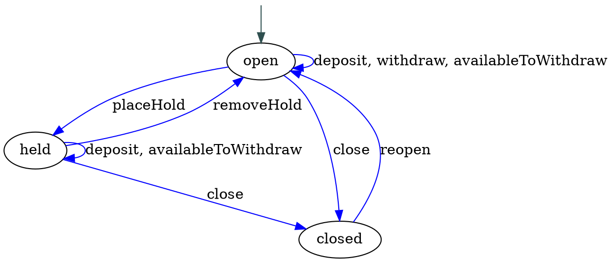

In "[How I Learned to Stop Worrying and ❤️ the State Machine][forde]," we built an extremely basic [state machine][fsm] to model a bank account.

[forde]: http://raganwald.com/2018/02/23/forde.html

State machines, as we discussed, are a very useful tool for organizing the behaviour of [domain models], representations of meaningful real-world concepts pertinent to a sphere of knowledge, influence or activity (the "domain") that need to be modelled in software.

[fsm]: https://en.wikipedia.org/wiki/Finite-state_machine
[Domain models]: https://en.wikipedia.org/wiki/Domain_model

A state machine is an object, but it has a distinctive "behaviour." It is always in exactly one of a finite number of states, and its behaviour is determined by its state, right down to what methods it has in each state and which other states a method may or may not transition the state machine to.

This is interesting! So interesting, that we are going to spend a few minutes looking strictly at state machine behaviour, and more specifically, at the [interface] a state machine has with the entities that use it.

[interface]: https://en.wikipedia.org/wiki/Interface_(computing)

Let's get started.

---

[](https://www.flickr.com/photos/hartman045/3503671671)

### our bank account state machine

Here's a small variation on the "bank account" code we wrote:[^account][^weakmap]

[^account]: Banking software is not actually written with objects that have methods like `.deposit` for soooooo many reasons, but this toy example describes something most people understand on a basic level, even if they aren't familiar with the needs of banking infrastructure, correctness, and so forth.

[^weakmap]: We're also using a slightly different pattern for associating state machines with their states, based on [weak maps](https://developer.mozilla.org/en-US/docs/Web/JavaScript/Reference/Global_Objects/WeakMap).

```javascript
// The naïve state machine extracted from http://raganwald.com/2018/02/23/forde.html
// Modified to use weak maps for "private" state

const STATES = Symbol("states");
const STARTING_STATE = Symbol("starting-state");
const RESERVED = [STARTING_STATE, STATES];

const MACHINES_TO_CURRENT_STATE_NAMES = new WeakMap();
const MACHINES_TO_STARTING_STATES = new WeakMap();
const MACHINES_TO_NAMES_TO_STATES = new WeakMap();

function getStateName (machine) {
  return MACHINES_TO_CURRENT_STATE_NAMES.get(machine);
}

function getState (machine) {
  return MACHINES_TO_NAMES_TO_STATES.get(machine)[getStateName(machine)];
}

function setState (machine, stateName) {
  MACHINES_TO_CURRENT_STATE_NAMES.set(machine, stateName);
}

function transitionsTo (stateName, fn) {
  return function (...args) {
    const returnValue = fn.apply(this, args);
    setState(this, stateName);
    return returnValue;
  };
}

function BasicStateMachine (description) {
  const machine = {};

  // Handle all the initial states and/or methods
  const propertiesAndMethods = Object.keys(description).filter(property => !RESERVED.includes(property));
  for (const property of propertiesAndMethods) {
    machine[property] = description[property];
  }

  // now its states
  MACHINES_TO_NAMES_TO_STATES.set(machine, description[STATES]);

  // what event handlers does it have?
  const eventNames = Object.entries(MACHINES_TO_NAMES_TO_STATES.get(machine)).reduce(
    (eventNames, [state, stateDescription]) => {
      const eventNamesForThisState = Object.keys(stateDescription);

      for (const eventName of eventNamesForThisState) {
        eventNames.add(eventName);
      }
      return eventNames;
      },
    new Set()
  );

  // define the delegating methods
  for (const eventName of eventNames) {
    machine[eventName] = function (...args) {
      const handler = getState(machine)[eventName];
      if (typeof handler === 'function') {
        return getState(machine)[eventName].apply(this, args);
      } else {
        throw `invalid event ${eventName}`;
      }
    }
  }

  // set the starting state
  MACHINES_TO_STARTING_STATES.set(machine, description[STARTING_STATE]);
  setState(machine, MACHINES_TO_STARTING_STATES.get(machine));

  // we're done
  return machine;
}

const account = BasicStateMachine({
  balance: 0,

  [STARTING_STATE]: 'open',
  [STATES]: {
    open: {
      deposit (amount) { this.balance = this.balance + amount; },
      withdraw (amount) { this.balance = this.balance - amount; },
      availableToWithdraw () { return (this.balance > 0) ? this.balance : 0; },
      placeHold: transitionsTo('held', () => undefined),
      close: transitionsTo('closed', function () {
        if (this.balance > 0) {
          // ...transfer balance to suspension account
        }
      })
    },
    held: {
      removeHold: transitionsTo('open', () => undefined),
      deposit (amount) { this.balance = this.balance + amount; },
      availableToWithdraw () { return 0; },
      close: transitionsTo('closed', function () {
        if (this.balance > 0) {
          // ...transfer balance to suspension account
        }
      })
    },
    closed: {
      reopen: transitionsTo('open', function () {
        // ...restore balance if applicable
      })
    }
  }
});
```

([code](https://gist.github.com/raganwald/e4e92910e3039a5bd513cf36b6a7f95d#file-naive-es6))

It's simple, and it seems to work. What's the problem?

---

[](https://www.flickr.com/photos/opensourceway/6006414578)

### reflecting on state machines

> In computer science, [reflection] is the ability of a computer program to examine, introspect, and modify its own structure and behaviour at runtime.--[Wikipedia][reflection]

[reflection]: https://en.wikipedia.org/wiki/Reflection_(computer_programming)

Remember we talked about objects exposing their interface? In JavaScript, we can use code to examine the methods a bank account responds to:

```javascript
function methodsOf (obj) {
  const list = [];

  for (const key in obj) {
    if (typeof obj[key] === 'function') {
      list.push(key);
    }
  }
  return list;
}

methodsOf(account)
  //=> deposit, withdraw, availableToWithdraw, placeHold, close, removeHold, reopen
```

This is technically correct, because we wrote methods that delegated all of these "events" to the current state. But this is *semantically* wrong, because the whole idea behind a state machine is that the methods it responds to vary according to what state it is in.

For example, when an object is created, it is in 'open' state, and `placehold`, `removeHold`, and `reopen` are all invalid methods. Our interface is lying to the outside would about what methods the object truly supports. This is an artefact of our design: We chose to implement methods, but then throw `invalid method` if an object in a particular state was not supposed to respond to a particular event.

The ideal would be for it not to have these methods at all, so that the standard way that we use our programming language to determine whether an object responds to a method--testing for a member that is a function--just works.

One way to go about this is to replace all the delegation methods with prototype mongling. First, the new `setState` method:[^mongle]

[^mongle]: **mongle**: *v*, to molest or disturb.

```javascript
function setState (machine, stateName) {
  MACHINES_TO_CURRENT_STATE_NAMES.set(machine, stateName);
  Object.setPrototypeOf(machine, getState(machine));
}
```

Now we can remove all the code that writes the delegation methods:

```javascript
function RefectiveStateMachine (description) {
  const machine = {};

  // Handle all the initial states and/or methods
  const propertiesAndMethods = Object.keys(description).filter(property => !RESERVED.includes(property));
  for (const property of propertiesAndMethods) {
    machine[property] = description[property];
  }

  // now its states
  MACHINES_TO_NAMES_TO_STATES.set(machine, description[STATES]);

  // set the starting state
  MACHINES_TO_STARTING_STATES.set(machine, description[STARTING_STATE]);
  setState(machine, MACHINES_TO_STARTING_STATES.get(machine));

  // we're done
  return machine;
}
```

How well does it work? Let's try it with `account = ReflectiveStateMachine({ ... })` more-or-less as before:

```javascript
methodsOf(account)
  //=> deposit, withdraw, availableToWithdraw, placeHold, close

account.placeHold()
methodsOf(account)
  //=> removeHold, deposit, availableToWithdraw, close
```

([code](https://gist.github.com/raganwald/e4e92910e3039a5bd513cf36b6a7f95d#file-simple-reflection-es6))

Now we have a state machine that correctly exposes the shallowest part of its interface, the methods that it responds to at any one time. What else might other code be interested in? And why?

---

[](https://www.flickr.com/photos/thristian/371670597)

### descriptions and diagrams for code

Two things have been proven to be consistently true since the dawn of human engineering:

1. Using a diagram, schematic, blueprint, or other symbolic representation of work to be done helps us plan our work, do our work,  verify that our work is correctly done, and understand our work.
2. Diagrams, schematics, blueprints, and other symbolic representations of work invariably drift from the work over time, until their inaccuracies present more harm than good.

This is especially true of programming, where change happens rapidly and "documentation" lags woefully behind. In early days, researchers toyed with various ways of making executable diagrams for programs: Humans would draw a diagram that communicated the program's behaviour, and the computer would interpret it directly.

With such a scheme, we'd use a special editor to draw something like this:


And the machine would simply execute it as a state machine. Naturally, there have been variations over the years, such as having the machine generate a template that humans would fill in, and so forth. But the results have always been unsatisfactory, not least because diagrams often scale well for reading about code, but not for writing code.

Another approach has been to dynamically generate diagrams and comments of one form or another. Many modern programming frameworks can generate documentation from the source code itself, sometimes using special annotations as a kind of markup. The value of this approach is that when the code changes, so does the documentation.

Can we generate state transition diagrams from our source code?

Well, we're not going to write an entire graphics generation engine, although that would be a pleasant diversion. But what we will do is generate a kind of program that another engine can consume to produce our documentation. The diagrams in this essay were generated with [Graphviz], free software that generates graphs specified with the [DOT] graph description language.

[Graphviz]: https://en.wikipedia.org/wiki/Graphviz
[DOT]: https://en.wikipedia.org/wiki/DOT_(graph_description_language)

The dot file to generate the above diagram looks like this:



We could generate this DOT file if we have a list of states, events, and the states those events transition to. Getting a list of states and events is easy. But what we don't have is the starting state, nor do we have the states these methods (a/k/a "events") transition to.

We could easily store the starting state for each state machine in a weak map. But what to do about the transitions? This is a deep problem. Throughout our programming explorations, we have repeatedly feasted on JavaScript's ability for functions to consume other functions as arguments and return new functions. Using this, we have written many different kinds of decorators, including `transitionsTo`.

The beauty of functions returning functions is that closures form a hard encapsulation: The closure wrapping a function is available only functions created within its scope, not to any other scope. The drawback is that when we want to do some inspection, we cannot pierce the closure. We simply cannot tell from the function that `transitionsTo` returns what state it will transition to.

We have a few options. One is to use a different form of description that encodes the destination states without a `transitionsTo` function.

---

[](https://www.flickr.com/photos/remedy451/8061881196)

### a new-old kind of notation for bank accounts

When [we first formulated a notation for state machines][forde], we considered a more declarative format that encoded states and transitions using nested objects. It looked a little like this:

```javascript
const TRANSITIONS = Symbol("transitions");
const STARTING_STATE = Symbol("starting-state");

const account = TransitionOrientedStateMachine({
  balance: 0,

  [STARTING_STATE]: 'open',
  [TRANSITIONS]: {
    open: {
      deposit (amount) { this.balance = this.balance + amount; },
      withdraw (amount) { this.balance = this.balance - amount; },
      availableToWithdraw () { return (this.balance > 0) ? this.balance : 0; },

      held: {
        placeHold () {}
      },

      closed: {
        close () {
          if (this.balance > 0) {
            // ...transfer balance to suspension account
          }
        }
      }
    },

    held: {
      deposit (amount) { this.balance = this.balance + amount; },
      availableToWithdraw () { return 0; },

      open: {
        removeHold () {}
      },

      closed: {
        close () {
          if (this.balance > 0) {
            // ...transfer balance to suspension account
          }
        }
      }
    },

    closed: {
      open: {
        reopen () {
          // ...restore balance if applicable
        }
      }
    }
  }
});
```

This is touch more verbose, but we can write a `StateMachine` to do all the interpretation work. It will keep the description but translate the methods to use `transitionsTo` for us:

```javascript
const MACHINES_TO_TRANSITIONS = new WeakMap();

function TransitionOrientedStateMachine (description) {
  const machine = {};

  // Handle all the initial states and/or methods
  const propertiesAndMethods = Object.keys(description).filter(property => !RESERVED.includes(property));
  for (const property of propertiesAndMethods) {
    machine[property] = description[property];
  }

  // set the transitions for later reflection
  MACHINES_TO_TRANSITIONS.set(machine, description[TRANSITIONS]);

  // create its top-level state prototypes
  MACHINES_TO_NAMES_TO_STATES.set(machine, Object.create(null));

  for (const state of Object.keys(MACHINES_TO_TRANSITIONS.get(machine))) {
    const stateObject = Object.create(null);
    const stateDescription = MACHINES_TO_TRANSITIONS.get(machine)[state];
    const nonTransitioningMethods = Object.keys(stateDescription).filter(name => typeof stateDescription[name] === 'function');
    const destinationStates = Object.keys(stateDescription).filter(name => typeof stateDescription[name] !== 'function');

    for (const nonTransitioningMethodName of nonTransitioningMethods) {
      const nonTransitioningMethod = stateDescription[nonTransitioningMethodName];

      stateObject[nonTransitioningMethodName] = nonTransitioningMethod;
    }

    for (const destinationState of destinationStates) {
      const destinationStateDescription = stateDescription[destinationState];
      const transitioningMethodNames = Object.keys(destinationStateDescription).filter(name => typeof destinationStateDescription[name] === 'function');

      for (const transitioningMethodName of transitioningMethodNames) {
        const transitioningMethod = destinationStateDescription[transitioningMethodName];

        stateObject[transitioningMethodName] = transitionsTo(destinationState, transitioningMethod);
      }
    }

    MACHINES_TO_NAMES_TO_STATES.get(machine)[state] = stateObject;
  }

  // set the starting state
  MACHINES_TO_STARTING_STATES.set(machine, description[STARTING_STATE]);
  setState(machine, MACHINES_TO_STARTING_STATES.get(machine));

  // we're done
  return machine;
}
```

And now we can write a `getTransitions` function that extracts the structure of the transitions:

```javascript
function getTransitions (machine) {
  const description = { [STARTING_STATE]: MACHINES_TO_STARTING_STATES.get(machine) };
  const transitions = MACHINES_TO_TRANSITIONS.get(machine);

  for (const state of Object.keys(transitions)) {
    const stateDescription = transitions[state];

    description[state] = Object.create(null);
    const selfTransitions = [];

    for (const descriptionKey of Object.keys(stateDescription)) {
      const innerDescription = stateDescription[descriptionKey];

      if (typeof innerDescription === 'function' ) {
        selfTransitions.push(descriptionKey);
      } else {
        const destinationState = descriptionKey;
        const transitionEvents = Object.keys(innerDescription);

        description[state][destinationState] = transitionEvents;
      }
    }

    if (selfTransitions.length > 0) {
      description[state][state] = selfTransitions;
    }
  }

  return description;
}

getTransitions(account)
  //=> {
    open: {
      open: ["deposit", "withdraw", "availableToWithdraw"],
      held: ["placeHold"],
      closed: ["close"]
    },
    held: {
      open: ["removeHold"],
      held: ["deposit", "availableToWithdraw"],
      closed: ["close"]
    },
    closed: {
      open: ["reopen"]
    },
    Symbol(starting-state): "open"
  }
```

🎉‼️

With `getTransitions` in hand, we're ready to generate a DOT file from the symbolic description:

```javascript
function dot (machine, name) {
  const transitionsForMachine = getTransitions(machine);
  const startingState = transitionsForMachine[STARTING_STATE];
  const dot = [];

  dot.push(`digraph ${name} {`);
  dot.push('');
  dot.push('  start [label="", fixedsize="false", width=0, height=0, shape=none];');
  dot.push(`  start -> ${startingState} [color=darkslategrey];`);

  for (const state of Object.keys(transitionsForMachine)) {
    dot.push('');
    dot.push(`  ${state}`);
    dot.push('');

    const stateDescription = transitionsForMachine[state];

    for (const destinationState of Object.keys(stateDescription)) {
      const events = stateDescription[destinationState];

      dot.push(`  ${state} -> ${destinationState} [color=blue, label="${events.join(', ')}"];`);
    }
  }

  dot.push('}');

  return dot.join("\r");
}

dot(account, "Account")
  //=>
    digraph Account {

      start [label="", fixedsize="false", width=0, height=0, shape=none];
      start -> open [color=darkslategrey];

      open

      open -> open [color=blue, label="deposit, withdraw, availableToWithdraw"];
      open -> held [color=blue, label="placeHold"];
      open -> closed [color=blue, label="close"];

      held

      held -> open [color=blue, label="removeHold"];
      held -> held [color=blue, label="deposit, availableToWithdraw"];
      held -> closed [color=blue, label="close"];

      closed

      closed -> open [color=blue, label="reopen"];
    }
}
```

([code](https://gist.github.com/raganwald/e4e92910e3039a5bd513cf36b6a7f95d#file-draw-diagrams-es6))

We can feed this `.dot` file to Graphviz, and it will produce the image we see right in this blog post. In fact, the image in this blog post was produced from Graphviz in exactly this way.

So. We now have a way of drawing state transition diagrams for state machines. Being able to extract the semantic structure of an object--like the state transitions for a state machine--is a useful kind of reflection, and one that exists at a higher semantic level than simply reporting on things like the methods an object responds to or the properties it has.

---

[](https://www.flickr.com/photos/governmentofalberta/23577005941)

### should a state machine hide the fact that it's a state machine?

People talk about [information hiding] as separating the responsibility for an object's "implementation" from its "interface." The question here is whether an object's states, transitions between states, and methods in each state are part of its implementation, or whether they are part of its interface, its contracted behaviour.

One way to tell is to ask ourselves whether changing those things will break other code. If we can change the transitions of a state machine without changing any other code in an app, it's fair to say that the transitions are "just implementation details," Just as changing a HashMap class to use a [Cockoo Hash] instead of a [Hash Table] doesn't require us to change any of the code that interacts with our HashMap.

[Cockoo Hash]: https://en.wikipedia.org/wiki/Cuckoo_hashing
[Hash Table]: https://en.wikipedia.org/wiki/Hash_table

So how about our bank accounts? Consider the following sequence:

```javascript
account.availableToWithdraw()
  //=> 0

account.deposit(42);

account.availableToWithdraw()
  //=> ???
```

Does the second `.availableToWithdraw()` return forty-two? Or zero? That depends upon whether the account is open or held, and that isn't a private secret that only the account knows about. We know this, because people openly talk about whether accounts are open, held, or closed. People build processes around the account's state, and it's certainly part of the account's design that the `.placeHold` method transitions an account into `held` state.

From this, we get that accounts should certainly *behave* like state machines. And from that, it's reasonable that other pieces of code ought to be able to dynamically inspect an account's current state, as well as its complete graph of states and transitions. That's as much a part of its public interface as any particular method.[^ofcourse]

[^ofcourse]: Of course, we could implement a state machine in some other way, such that it *behaves like* a state machine but is implemented in some other fashion. That would be changing its implementation and not its interface. We could, for example, rewrite our `StateMachine` function to generate a collection of actors communicating with asynchronous method passing. The value of our curent approach is that the implementation strongly mirrors the interface, which has certain benefits for readability.

It follows that in addition to our `ReflectiveStateMachine` function, we ought to also make both `getTransitions` and `getStateName` "public" functions that every other entity can interact with. `setState`, on the other hand, is best left as a "private" function: To preserve the proper business logic, other entities should invoke methods that perform the appropriate transitions, not directly change state.

We can even create public functions like:

```javascript
function isStateMachine (object) {
  return MACHINES_TO_NAMES_TO_STATES.has(object);
}
```

So, now we have an understanding of a state machine, the behaviour it contractually guarantees, and how it might be organized such that it can expose its contract dynamically to other code.

But speaking of behaviour...

---

[](https://www.flickr.com/photos/23510510@N03/5268897445)

### it's never as simple as it seems in a blog post

One of the reasons we don't see as many explicit state machines "in the wild" as we'd expect is that there is a perception that state machines are great when we've performed an exhaustive "Big Design Up Front" analysis, and have perfectly identified all of the states and transitions.

Many programmers believe that in a more agile, incremental process, we're constantly *discovering* requirements and methods. We may not know that we have a state machine until later in the process, and things being messy, a domain model may not fit neatly into the state machine model even if it appears to have states.

For example, instead of being told that a bank account might be open, held, or closed, we might be told something different:

- A bank account is either open or closed;
- An open bank account is either held or not held;

So now we are told that an account doesn't have one single state, it has two flags: open/closed and held/not-held. That doesn't fit the state machine model at all, and refactoring it into open/held/closed may not be appropriate. This is an extremely simple example, but impedence mismatches like this are common, and over time a model may accrete a half-dozen or more toggles and enumerations that represent little states within the domain model's larger state.

This is maddening, because we know how to model open/closed as a state machine, and if we didn't have to worry about closed accounts, we also know how to model held/not-held as a state machine.

What to do?

---

[](https://www.flickr.com/photos/41829005@N02/6189894283)

### i heard you liked state machines, so…

If we look at a bank account as having two flags, and between their possible settings there are three valid states, we don't see a state machine. We see a stateful object. But hidden in our implementation is a clue as to how we can solve this semantically.

As implemented, state machines are objects that delegate their behaviour to a state object. There's one state object for each possible state.

The state object for closed state has just one method, `reopen`. Our problem with the state object for `open` state is that it has two differnt behaviours, depending on whether the account is `held` or `not-held`.

That sounds very familiar!

What we are describing is that a bank account has two states. One of them, `closed`, is a simple object. But the other, `open`, is itself a state machine! It has two states, `held`, and `not-held`.

If we allow state object to be state machines, we can actually model our bank account exactly as our business users describe it.

But first, we're going to need a bigger notation.[^biggerboat]

[^biggerboat]: Or a [bigger boat](https://www.youtube.com/watch?v=2I91DJZKRxs)!

---

[](https://www.flickr.com/photos/lizadaly/4373330774)

### a bigger notation for state machines

Let's look at what we want to model. For starters, we want an account that has `open` and `closed` states, and we want to describe what is guaranteed to be the case for each state:

```javascript
const account = HierarchalStateMachine({
  balance: 0,

  [STARTING_STATE]: 'open',
  [TRANSITIONS]: {
    open: {
      deposit (amount) { this.balance = this.balance + amount; }

      closed: {
        close () {
          if (this.balance > 0) {
            // ...transfer balance to suspension account
          }
        }
      }
    },
    closed: {
      open: {
        reopen () {
          // ...restore balance if applicable
        }
      }
    }
  }
});
```

And if we were thinking about a state machine nested _within_ the `open` state, it would loook like this:

```javascript
HierarchalStateMachine({
  [STARTING_STATE]: 'not-held',
  [TRANSITIONS]: {
    ['not-held']: {
      withdraw (amount) { this.balance = this.balance - amount; },
      availableToWithdraw () { return (this.balance > 0) ? this.balance : 0; },

      held: {
        placeHold () {}
      }
    },
    held: {
      availableToWithdraw () { return 0; },

      ['not-held']: {
        removeHold () {}
      }
    }
});
```

It's a state machine with two states. In `not-held`, it supports `withdraw`, `availableToWithdraw`, and `placewHold`. In `held`, it supports `availableToWithdraw` and `removeHold`. It does not need support deposit, because our top-level state machine does that.

So now, we need a way to put the second notation inside the first notation, perhaps like this:

```javascript
const INNER = Symbol("inner");

const account = HierarchalStateMachine({
  balance: 0,

  [STARTING_STATE]: 'open',
  [TRANSITIONS]: {
    open: {
      deposit (amount) { this.balance = this.balance + amount; },

      closed: {
        close () {
          if (this.balance > 0) {
            // ...transfer balance to suspension account
          }
        }
      },

      [INNER]: {
        [STARTING_STATE]: 'not-held',
        [TRANSITIONS]: {
          ['not-held']: {
            withdraw (amount) { this.balance = this.balance - amount; },
            availableToWithdraw () { return (this.balance > 0) ? this.balance : 0; },

            held: {
              placeHold () {}
            }
          },
          held: {
            availableToWithdraw () { return 0; },

            ['not-held']: {
              removeHold () {}
            }
          }
        }
      }
    },

    closed: {
      open: {
        reopen () {
          // ...restore balance if applicable
        }
      }
    }
  }
});
```

---

[](https://www.flickr.com/photos/29233640@N07/14724197800)

### using prototypical inheritance to model hierarchal state machines

Here's what we want to happen: When an account enters `open` state, as per usual, its prototype will be set to its `open` state object. That will have a `deposit` and `close` method. But what will the `open` state object's protoype be? Ah! That will be the inner state machine that has `held` and `not-held` methods. And every time the object enters the `open` state, the inner state machine will enter the `not-held` state.

So the prototype chain will look something like this:

```
account -> open -> open.inner -> open.inner.not-held
```

If the account is held, it will change to:

```
account -> open -> open.inner -> open.inner.held
```

And if it is closed, it will change to:

```
account -> closed
```

The first thing we're going to need is to slightly modify our state machine to take a prototype as an argument, and then make sure that every `stateObject` we create for it points to that prototype:

```javascript
function HierarchalStateMachine (description, prototype = Object.prototype) {
  // ...

  for (const state of Object.keys(MACHINES_TO_TRANSITIONS.get(machine))) {
    const stateObject = Object.create(prototype);

    // ...
  }
  // ...
}
```

Armed with this, we can look for `[INNER]` in any state description. If we don't find one, the state is going to be whatever we construct for our `stateObject`.

But if we do find an `[INNER]`, we will recursively construct a state machine from its description, but have its protptype be the `stateObject` we have constructed. And our state is going to be the inner state machine:

```javascript
function HierarchalStateMachine (description, prototype = Object.prototype) {

  // ...

  for (const state of Object.keys(MACHINES_TO_TRANSITIONS.get(machine))) {
    const stateObject = Object.create(prototype);

    // ...

    const innerStateMachineDescription = stateDescription[INNER];

    // ...

    if (innerStateMachineDescription == null) {
      MACHINES_TO_NAMES_TO_STATES.get(machine)[state] = stateObject;
    } else {
      const innerStateMachine = HierarchalStateMachine(
        innerStateMachineDescription,
        stateObject
      );

      MACHINES_TO_NAMES_TO_STATES.get(machine)[state] = innerStateMachine;
    }
  }

  // ...
}
```

One final thing. When we set the state for a state machine, we have to figure out whether the state machine can handle it, or whether it should delegate that to a nested state machine:

```javascript
function setState (machine, stateName) {
  const currentState = getState(machine);

  if (hasState(machine, stateName)) {
  	setDirectState(machine, stateName)
  } else if (isStateMachine(currentState)) {
    setState(currentState, stateName);
  } else {
    console.log(`illegal transition to ${stateName}`, machine);
  }
}

function setDirectState (machine, stateName) {
  MACHINES_TO_CURRENT_STATE_NAMES.set(machine, stateName);

  const newState = getState(machine);
  Object.setPrototypeOf(machine, newState);

  if (isStateMachine(newState)) {
    setState(newState, MACHINES_TO_STARTING_STATES.get(newState));
  }
}
```

Ta da!

([code](https://gist.github.com/raganwald/e4e92910e3039a5bd513cf36b6a7f95d#file-hierarchal-es6))

---

### javascript allongé, the six edition

If you enjoyed this essay, you'll ❤️ [JavaScript Allongé, the Six Edition](http://leanpub.com/javascriptallongesix/c/state-machines). It's 100% free to read online, and for a limited time, if you use [this coupon](http://leanpub.com/javascriptallongesix/c/state-machines), you can buy it for $10 off. That's a whopping 37% savings!

---

[](https://www.flickr.com/photos/migreenberg/7155283115)

# notes
