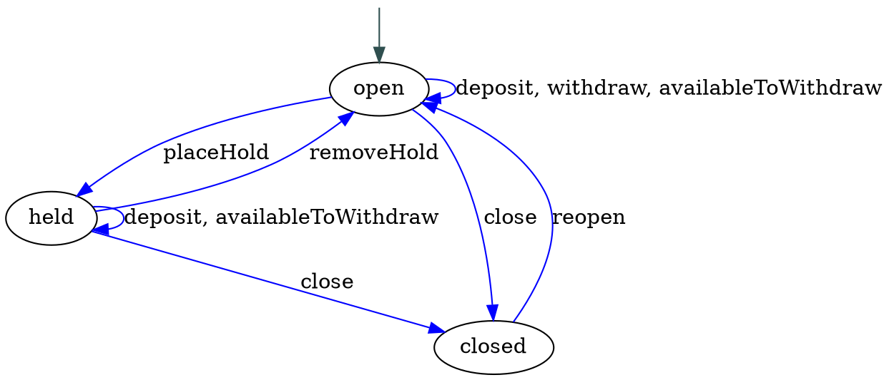

In "[How I Learned to Stop Worrying and ❤️ the State Machine][forde]," we built an extremely basic [state machine][fsm] to model a bank account.

[forde]: http://raganwald.com/2018/02/23/forde.html

State machines, as we discussed, are a very useful tool for organizing the behaviour of [domain models], representations of meaningful real-world concepts pertinent to a sphere of knowledge, influence or activity (the "domain") that need to be modelled in software.

[fsm]: https://en.wikipedia.org/wiki/Finite-state_machine
[Domain models]: https://en.wikipedia.org/wiki/Domain_model

A state machine is an object, but it has a distinctive "behaviour." It is always in exactly one of a finite number of states, and its behaviour is determined by its state, right down to what methods it has in each state and which other states a method may or may not transition the state machine to.

This is interesting!

---

[](https://www.flickr.com/photos/governmentofalberta/23577005941)

One of the fundamental tenets of object-oriented software design is that objects practise [information hiding].

> In computer science, [information hiding] is the principle of segregation of the design decisions in a computer program that are most likely to change, thus protecting other parts of the program from extensive modification if the design decision is changed. The protection involves providing a stable interface which protects the remainder of the program from the implementation (the details that are most likely to change).

[information hiding]: https://en.wikipedia.org/wiki/Information_hiding

The common, "default" interpretation of OOP is that objects should hide *everything* about their internal state. The only things other entities are permitted to do is to send objects messages (as usually implemented by "invoking methods"), and examine any values returned.

Adherents of this philosophy usually extend it to allow other entities to know the *interface* of an object. Meaning, what methods does it support? In JavaScript, we can enumerate an object's properties. If we code in the standard style, the properties that are also functions are the object's methods.

In this minimal interpretation, objects have a "contract" with other objects to respond to the methods in their "interface," and nothing else. No other guarantees are offered.

It's hard to write "No other guarantees are offered" with a straight face. If we have an ordered collection, and we give it a method called `sort`, we are absolutely and positively implying that invoking this method sorts the collection.[^sorted]

[^sorted]: In this nomenclature, `.sort()` sorts an ordered collection in-place, while `.sorted()` returns a sorted version of the ordered collection.

Objects are useless without offering some sort of domain-specific behaviour contract. So what we generally mean when we talk about an object's contract is not just the set of methods it responds to, but what behaviour another object can depend upon it following.

Now, what does it mean for another object to depend upon our object? Well, since all other objects can do is send messages and examine the return values, we mean that an object's contracted behaviour speaks only in terms of methods invoked and values returned.

> An example of a behaviour contract would be something along the lines of: "If you start with an empty collection, `.push` the values 1, 3, and 2 in succession, `.sort` the collection, and then invoke `.join(', ')`, you will receive '1, 2, 3' in return." Examples like this are often encoded as unit tests, simultaneously documenting and validating the contract.

This contract says nothing about whether the collection is implemented as a vector of contiguous memory addresses, a linked list, or even a mapping from position to value. It speaks to what another object may expect from our collection.

Fair enough. Now how does this apply to state machines?

---

[](https://www.flickr.com/photos/hartman045/3503671671)

### our bank account state machine

Here's the "bank account" code we wrote:[^account]

[^account]: Banking software is not actually written with objects that have methods like `.deposit` for soooooo many reasons, but this toy example describes something most people understand on a basic level, even if they aren't familiar with the needs of banking infrastructure, correctness, and so forth.

```javascript
const STATE = Symbol("state");
const STATES = Symbol("states");
const STARTING_STATE = Symbol("starting-state");
const RESERVED = [STARTING_STATE, STATES];

function transitionsTo (stateName, fn) {
  return function (...args) {
    const returnValue = fn.apply(this, args);
    this[STATE] = this[STATES][stateName];
    return returnValue;
  };
}

function StateMachine (description) {
  const machine = {};

  // Handle all the initial states and/or methods
  const propertiesAndMethods = Object.keys(description).filter(property => !RESERVED.includes(property));
  for (const property of propertiesAndMethods) {
    machine[property] = description[property];
  }

  // now its states
  machine[STATES] = description[STATES];

  // what event handlers does it have?
  const eventNames = Object.entries(description[STATES]).reduce(
    (eventNames, [state, stateDescription]) => {
      const eventNamesForThisState = Object.keys(stateDescription);

      for (const eventName of eventNamesForThisState) {
        eventNames.add(eventName);
      }
      return eventNames;
      },
    new Set()
  );

  // define the delegating methods
  for (const eventName of eventNames) {
    machine[eventName] = function (...args) {
      const handler = this[STATE][eventName];
      if (typeof handler === 'function') {
        return this[STATE][eventName].apply(this, args);
      } else {
        throw `invalid event ${eventName}`;
      }
    }
  }

  // set the starting state
  machine[STATE] = description[STATES][description[STARTING_STATE]];

  // we're done
  return machine;
}

const account = StateMachine({
  balance: 0,

  [STARTING_STATE]: 'open',
  [STATES]: {
    open: {
      deposit (amount) { this.balance = this.balance + amount; },
      withdraw (amount) { this.balance = this.balance - amount; },
      availableToWithdraw () { return (this.balance > 0) ? this.balance : 0; },
      placeHold: transitionsTo('held', () => undefined),
      close: transitionsTo('closed', function () {
        if (this.balance > 0) {
          // ...transfer balance to suspension account
        }
      })
    },
    held: {
      removeHold: transitionsTo('open', () => undefined),
      deposit (amount) { this.balance = this.balance + amount; },
      availableToWithdraw () { return 0; },
      close: transitionsTo('closed', function () {
        if (this.balance > 0) {
          // ...transfer balance to suspension account
        }
      })
    },
    closed: {
      reopen: transitionsTo('open', function () {
        // ...restore balance if applicable
      })
    }
  }
});
```

([code](https://gist.github.com/raganwald/e4e92910e3039a5bd513cf36b6a7f95d#file-naive-es6))

It's simple, and it works. What's the problem?

---

[](https://www.flickr.com/photos/opensourceway/6006414578)

### reflecting on state machines

> In computer science, [reflection] is the ability of a computer program to examine, introspect, and modify its own structure and behaviour at runtime.--[Wikipedia][reflection]

[reflection]: https://en.wikipedia.org/wiki/Reflection_(computer_programming)

Remember we talked about objects exposing their interface? In JavaScript, we can use code to examine the methods a bank account responds to:

```javascript
function methodsOf (obj) {
  const list = [];

  for (const key in obj) {
    if (typeof obj[key] === 'function') {
      list.push(key);
    }
  }
  return list;
}

methodsOf(account)
  //=> deposit, withdraw, availableToWithdraw, placeHold, close, removeHold, reopen
```

This is technically correct, because we wrote methods that delegated all of these "events" to the current state. But this is *semantically* wrong, because the whole idea behind a state machine is that the methods it responds to vary according to what state it is in.

For example, when an object is created, it is in 'open' state, and `placehold`, `removeHold`, and `reopen` are all invalid methods. Our interface is lying to the outside would about what methods the object truly supports. This is an artefact of our design: We chose to implement methods, but then throw `invalid method` if an object in a particular state was not supposed to respond to a particular event.

The ideal would be for it not to have these methods at all, so that the standard way that we use our programming language to determine whether an object responds to a method--testing for a member that is a function--just works.

One way to go about this is with prototype mongling:[^mongle]

[^mongle]: **mongle**: *v*, to molest or disturb.

```javascript
function transitionsTo (stateName, fn) {
  return function (...args) {
    const returnValue = fn.apply(this, args);
    this[SET_STATE].call(this, stateName);
    return returnValue;
  };
}

const RESERVED = [STARTING_STATE, STATES];
const STATE = Symbol("state");
const SET_STATE = Symbol("setState");

function StateMachine (description) {
  const machine = {};

  // Handle all the initial states and/or methods
  const propertiesAndMethods = Object.keys(description).filter(property => !RESERVED.includes(property));
  for (const property of propertiesAndMethods) {
    machine[property] = description[property];
  }

  // now its states
  machine[STATES] = description[STATES];

  // set state method
  machine[SET_STATE] = function (state) {
    Object.setPrototypeOf(this, this[STATES][state]);
  }

  // set the starting state
  const starting_state = description[STARTING_STATE];
  machine[SET_STATE].call(machine, starting_state);

  // we're done
  return machine;
}

methodsOf(account)
  //=> deposit, withdraw, availableToWithdraw, placeHold, close

account.placeHold()
methodsOf(account)
  //=> removeHold, deposit, availableToWithdraw, close
```

([code](https://gist.github.com/raganwald/e4e92910e3039a5bd513cf36b6a7f95d#file-simple-reflection-es6))

Now we have a state machine that correctly exposes the shallowest part of its interface, the methods that it responds to at any one time. We'll have a look at its contracted behaviour in a moment, but first, a pleasant diversion.

---

[](https://www.flickr.com/photos/thristian/371670597)

### descriptions and diagrams for code

Two things have been proven to be consistently true since the dawn of human engineering:

1. Using a diagram, schematic, blueprint, or other symbolic representation of work to be done helps us plan our work, do our work,  verify that our work is correctly done, and understand our work.
2. Diagrams, schematics, blueprints, and other symbolic representations of work invariably drift from the work over time, until their inaccuracies present more harm than good.

This is especially true of programming, where change happens rapidly and "documentation" lags woefully behind. In early days, researchers toyed with various ways of making executable diagrams for programs: Humans would draw a diagram that communicated the program's behaviour, and the computer would interpret it directly.

With such a scheme, we'd use a special editor to draw something like this:


And the machine would simply execute it as a state machine. Naturally, there have been variations over the years, such as having the machine generate a template that humans would fill in, and so forth. But the results have always been unsatisfactory, not least because diagrams often scale well for reading about code, but not for writing code.

Another approach has been to dynamically generate diagrams and comments of one form or another. Many modern programming frameworks can generate documentation from the source code itself, sometimes using special annotations as a kind of markup. The value of this approach is that when the code changes, so does the documentation.

Can we generate state transition diagrams from our source code?

Well, we're not going to write an entire graphics generation engine, although that would be a pleasant diversion. But what we will do is generate a kind of program that another engine can consume to produce our documentation. The diagrams in this essay were generated with [Graphviz], free software that generates graphs specified with the [DOT] graph description language.

[Graphviz]: https://en.wikipedia.org/wiki/Graphviz
[DOT]: https://en.wikipedia.org/wiki/DOT_(graph_description_language)

The code to generate the above diagram looks like this:



We could generate this DOT file if we have a list of states, events, and the states those events transition to. Getting a list of states and events is easy:

```javascript
function transitions (machine) {
  const description = machine[STATES];

  return Object.keys(description).reduce(
    (acc, state) => Object.assign(acc, { [state]: methodsOf(description[state]) }),
    {}
  );
}

transitions(account)
  //=> {
    open: ["deposit", "withdraw", "availableForWithdrawal", "placeHold", "close"],
    held: ["removeHold", "deposit", "availableForWithdrawal", "close"],
    closed: ["reopen"]
  }
```

What we don't have is the starting state, nor do we have the states these methods (a/k/a "events") transition to. The starting state problem can be easily solved:

```javascript
function StateMachine (description) {
  // ...

  // set the starting state
  machine[STARTING_STATE] = description[STARTING_STATE];
  machine[SET_STATE].call(machine, machine[STARTING_STATE]);

  // ...
}

function transitions (machine) {
  const description = machine[STATES];

  return Object.keys(description).reduce(
    (acc, state) => Object.assign(acc, { [state]: methodsOf(description[state]) }),
    { [STARTING_STATE]: machine[STARTING_STATE] }
  );
}

transitions(account)
  //=> {
    open: ["deposit", "withdraw", "availableForWithdrawal", "placeHold", "close"],
    held: ["removeHold", "deposit", "availableForWithdrawal", "close"],
    closed: ["reopen"],
    Symbol(starting-state): "open"
  }
```

But what to do about the transitions? This is a deep problem. Throughout our programming explorations, we have repeatedly feasted on JavaScript's ability for functions to consume other functions as arguments and return new functions. Using this, we have written many different kinds of decorators, including `transitionsTo`.

The beauty of functions returning functions is that closures form a hard encapsulation: The closure wrapping a function is available only functions created within its scope, not to any other scope. The drawback is that when we want to do some inspection, we cannot pierce the closure. We simply cannot tell from the function that `transitionsTo` returns what state it will transition to.

We have a few options. One is to use a different form of description that encodes the destination states without a `transitionsTo` function.

---

[](https://www.flickr.com/photos/remedy451/8061881196)

### a new-old kind of notation for bank accounts

When [we first formulated a notation for state machines][forde], we considered a more declarative format that encoded states and transitions using nested objects. It looked a little like this:

```javascript
const TRANSITIONS = Symbol("transitions");
const STARTING_STATE = Symbol("starting-state");

const account = StateMachine({
  balance: 0,

  [STARTING_STATE]: 'open',
  [TRANSITIONS]: {
    open: {
      open: {
        deposit (amount) { this.balance = this.balance + amount; },
        withdraw (amount) { this.balance = this.balance - amount; },
        availableToWithdraw () { return (this.balance > 0) ? this.balance : 0; }
      },
      held: {
        placeHold () {}
      },
      closed: {
        close () {
          if (this.balance > 0) {
            // ...transfer balance to suspension account
          }
        }
      }
    },
    held: {
      open: {
        removeHold () {}
      },
      held: {
        deposit (amount) { this.balance = this.balance + amount; },
        availableToWithdraw () { return 0; }
      },
      closed: {
        close () {
          if (this.balance > 0) {
            // ...transfer balance to suspension account
          }
        }
      }
    },
    closed: {
      open: {
        reopen () {
          // ...restore balance if applicable
        }
      }
    }
  }
});
```

This is more verbose, but we can write a `StateMachine` to do all the interpretation work. It will keep the description but translate the methods to use `transitionsTo` for us:

```javascript
const RESERVED = [STARTING_STATE, TRANSITIONS];
const STATE = Symbol("state");
const STATES = Symbol("states");
const SET_STATE = Symbol("setState");

function transitionsTo (stateName, fn) {
  return function (...args) {
    const returnValue = fn.apply(this, args);
    this[SET_STATE].call(this, stateName);
    return returnValue;
  };
}

function StateMachine (description) {
  const machine = {};

  // Handle all the initial states and/or methods
  const propertiesAndMethods = Object.keys(description).filter(property => !RESERVED.includes(property));
  for (const property of propertiesAndMethods) {
    machine[property] = description[property];
  }

  // set the transitions for later reflection
  machine[TRANSITIONS] = description[TRANSITIONS]

  // create its state prototypes
  machine[STATES] = Object.create(null);

  for (const state of Object.keys(description[TRANSITIONS])) {
    const stateDescription = description[TRANSITIONS][state];

    machine[STATES][state] = {};
    for (const destinationState of Object.keys(stateDescription)) {
      const methods = stateDescription[destinationState];

      for (const methodName of Object.keys(methods)) {
        const value = stateDescription[destinationState][methodName];

        if (typeof value === 'function') {
          machine[STATES][state][methodName] = transitionsTo(destinationState, value);
        }
      }
    }
  }

  // set state method
  machine[SET_STATE] = function (state) {
    Object.setPrototypeOf(this, this[STATES][state]);
  }

  // set the starting state
  machine[STARTING_STATE] = description[STARTING_STATE];
  machine[SET_STATE].call(machine, machine[STARTING_STATE]);

  // we're done
  return machine;
}

methodsOf(account)
  //=> deposit, withdraw, availableToWithdraw, placeHold, close

account.placeHold()
methodsOf(account)
  //=> removeHold, deposit, availableToWithdraw, close
```

And now our `transitions` function can generate most of what we want:

```javascript
function transitions (machine) {
  const description = { [STARTING_STATE]: machine[STARTING_STATE] };
  const transitions = machine[TRANSITIONS];

  for (const state of Object.keys(transitions)) {
    const stateDescription = transitions[state];

    description[state] = Object.create(null);
    for (const destinationState of Object.keys(stateDescription)) {
      description[state][destinationState] = Object.keys(stateDescription[destinationState]);
    }
  }

  return description;
}

transitions(account)
  //=> {
    open: {
      open: ["deposit", "withdraw", "availableToWithdraw"],
      held: ["placeHold"],
      closed: ["close"]
    },
    held: {
      open: ["removeHold"],
      held: ["deposit", "availableToWithdraw"],
      closed: ["close"]
    },
    closed: {
      open: ["reopen"]
    },
    Symbol(starting-state): "open"
  }
```

🎉‼️ We're ready to generate a DOT file from the symbolic description:

```javascript
function dot (machine, name) {
  const transitionsForMachine = transitions(machine);
  const startingState = transitionsForMachine[STARTING_STATE];
  const dot = [];

  dot.push(`digraph ${name} {`);
  dot.push('');
  dot.push('  start [label="", fixedsize="false", width=0, height=0, shape=none];');
  dot.push(`  start -> ${startingState} [color=darkslategrey];`);

  for (const state of Object.keys(transitionsForMachine)) {
    dot.push('');
    dot.push(`  ${state}`);
    dot.push('');

    const stateDescription = transitionsForMachine[state];

    for (const destinationState of Object.keys(stateDescription)) {
      const events = stateDescription[destinationState];

      dot.push(`  ${state} -> ${destinationState} [color=blue, label="${events.join(', ')}"];`);
    }
  }

  dot.push('}');

  return dot.join("\r");
}

dot(account, "Account")
  //=>
    digraph Account {

      start [label="", fixedsize="false", width=0, height=0, shape=none];
      start -> open [color=darkslategrey];

      open

      open -> open [color=blue, label="deposit, withdraw, availableToWithdraw"];
      open -> held [color=blue, label="placeHold"];
      open -> closed [color=blue, label="close"];

      held

      held -> open [color=blue, label="removeHold"];
      held -> held [color=blue, label="deposit, availableToWithdraw"];
      held -> closed [color=blue, label="close"];

      closed

      closed -> open [color=blue, label="reopen"];
    }
}
```

([code](https://gist.github.com/raganwald/e4e92910e3039a5bd513cf36b6a7f95d#file-draw-diagrams-es6))

We can feed this `.dot` file to Graphviz, and it will produce the image we see right in this blog post. In fact, the image in this blog post was produced from Graphviz in exactly this way.

So. We now have a way of drawing state transition diagrams for state machines. Being able to extract the semantic structure of an object--like the state transitions for a state machine--is a useful kind of reflection, and one that exists at a higher semantic level than simply reporting on things like the methods an object responds to or the properties it has.

---

[](https://www.flickr.com/photos/nh53/3912835521)

Back to [information hiding]. The goal is to shield the parts of a program that are less likely to change, from the parts of a program that are most likely to change. Or in another way, "To shield the parts of a program that change infrequently, from the parts of a program that change frequently."

People also talk about separating the responsibility for an object's implementation from its interface. So here's a question: Do our `transitions` and `dot` functions violate information hiding? Is the fact that an account is implemented as a state machine an implementation detail that should be hidden from code that invokes methods like `.deposit`? Or is it part of its contracted behaviour?

So let's look at a bank account. In its most basic form, we can make deposits, and withdrawals, and besides the presence of `deposit`, `withdraw`, and `availableToWithdraw` methods, its contracted behaviour includes obvious stuff like, if you invoke `.availableToWithdraw()` and get a result, and then you invoke `.deposit(100)`, you expect that if you invoke `.availableToWithdraw()` again, you will get back a number that is 100 larger than the previous amount available to withdraw.


---

### javascript allongé, the six edition

If you enjoyed this essay, you'll ❤️ [JavaScript Allongé, the Six Edition](http://leanpub.com/javascriptallongesix/c/state-machines). It's 100% free to read online, and for a limited time, if you use [this coupon](http://leanpub.com/javascriptallongesix/c/state-machines), you can buy it for $10 off. That's a whopping 37% savings!

---

[](https://www.flickr.com/photos/migreenberg/7155283115)

# notes
