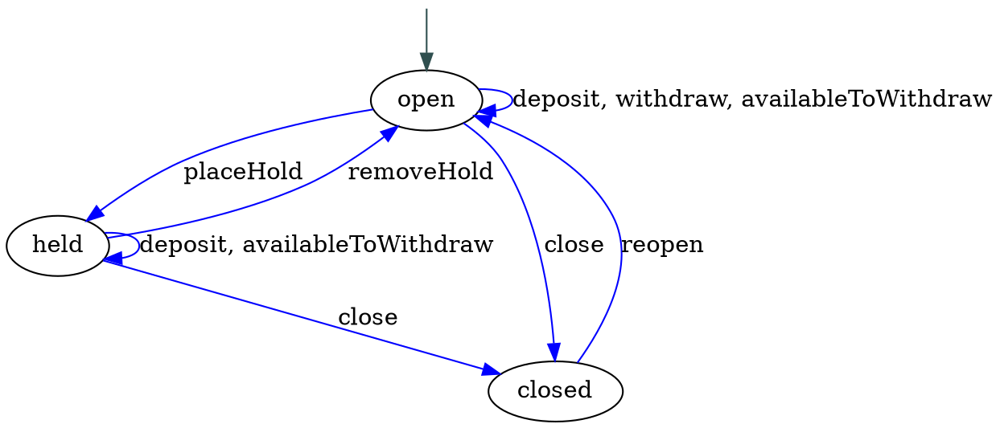

In "[How I Learned to Stop Worrying and ❤️ the State Machine][forde]," we built an extremely basic [state machine][fsm] to model a bank account.

[forde]: http://raganwald.com/2018/02/23/forde.html

State machines, as we discussed, are a very useful tool for organizing the behaviour of [domain models], representations of meaningful real-world concepts pertinent to a sphere of knowledge, influence or activity (the "domain") that need to be modelled in software.

[fsm]: https://en.wikipedia.org/wiki/Finite-state_machine
[Domain models]: https://en.wikipedia.org/wiki/Domain_model

---

[](https://www.amazon.com/Annotated-Alice-150th-Anniversary-Deluxe/dp/0393245438/ref=as_li_ss_tl?ie=UTF8&qid=1520186545&sr=8-1&keywords=annotated+alice&linkCode=ll1&tag=raganwald001-20&linkId=d1df3106d4d7d16e308413cb2ad54194)

### our bank account state machine

Here's the "bank account" code we wrote:[^account]

[^account]: Banking software is not actually written with objects that have methods like `.deposit` for soooooo many reasons, but this toy example describes something most people understand on a basic level, even if they aren't familiar with the needs of banking infrastructure, correctness, and so forth.

```javascript
const STATES = Symbol("states");
const STARTING_STATE = Symbol("starting-state");

const account = StateMachine({
  balance: 0,

  [STARTING_STATE]: 'open',
  [STATES]: {
    open: {
      deposit (amount) { this.balance = this.balance + amount; },
      withdraw (amount) { this.balance = this.balance - amount; },
      availableToWithdraw () { return (this.balance > 0) ? this.balance : 0; },
      placeHold: transitionsTo('held', () => undefined),
      close: transitionsTo('closed', function () {
        if (this.balance > 0) {
          // ...transfer balance to suspension account
        }
      })
    },
    held: {
      removeHold: transitionsTo('open', () => undefined),
      deposit (amount) { this.balance = this.balance + amount; },
      availableToWithdraw () { return 0; },
      close: transitionsTo('closed', function () {
        if (this.balance > 0) {
          // ...transfer balance to suspension account
        }
      })
    },
    closed: {
      reopen: transitionsTo('open', function () {
        // ...restore balance if applicable
      })
    }
  }
});
```

To make this work, we wrote this naïve `StateMachine` function:

```javascript
function transitionsTo (stateName, fn) {
  return function (...args) {
    const returnValue = fn.apply(this, args);
    this[STATE] = this[STATES][stateName];
    return returnValue;
  };
}

const RESERVED = [STARTING_STATE, STATES];
const STATE = Symbol("state");

function StateMachine (description) {
  const machine = {};

  // Handle all the initial states and/or methods
  const propertiesAndMethods = Object.keys(description).filter(property => !RESERVED.includes(property));
  for (const property of propertiesAndMethods) {
    machine[property] = description[property];
  }

  // now its states
  machine[STATES] = description[STATES];

  // what event handlers does it have?
  const eventNames = Object.entries(description[STATES]).reduce(
    (eventNames, [state, stateDescription]) => {
      const eventNamesForThisState = Object.keys(stateDescription);

      for (const eventName of eventNamesForThisState) {
        eventNames.add(eventName);
      }
      return eventNames;
      },
    new Set()
  );

  // define the delegating methods
  for (const eventName of eventNames) {
    machine[eventName] = function (...args) {
      const handler = this[STATE][eventName];
      if (typeof handler === 'function') {
        return this[STATE][eventName].apply(this, args);
      } else {
        throw `invalid event ${eventName}`;
      }
    }
  }

  // set the starting state
  machine[STATE] = description[STATES][description[STARTING_STATE]];

  // we're done
  return machine;
}
```

Having worked through the basics, in this essay we're going to consider some of the problems a naïve state machine presents, and mull over some of the ways we can improve on its basic idea.

---

[](https://www.flickr.com/photos/hartman045/3503671671)

### reflecting on state machines

> In computer science, [reflection] is the ability of a computer program to examine, introspect, and modify its own structure and behaviour at runtime.--[Wikipedia][reflection]

[reflection]: https://en.wikipedia.org/wiki/Reflection_(computer_programming)

We can use code to examine our bank account's behaviour:

```javascript
function methodsOf (obj) {
  const list = [];

  for (const key in obj) {
    if (typeof obj[key] === 'function') {
      list.push(key);
    }
  }
  return list;
}

methodsOf(account)
  //=> deposit, withdraw, availableToWithdraw, placeHold, close, removeHold, reopen
```

But this is semantically wrong. When an object is created, it is in 'open' state, and `placehold`, `removeHold`, and `reopen` are all invalid methods. Our interface is lying to the outside would about what methods the object truly supports. This is an artefact of our design: We chose to implement methods, but then throw `invalid method` if an object in a particular state was not supposed to respond to a particular event.

The ideal would be for it not to have these methods at all. One way to go about this is with prototype mongling:[^mongle]

[^mongle]: **mongle**: *v*, to molest or disturb.

```javascript
function transitionsTo (stateName, fn) {
  return function (...args) {
    const returnValue = fn.apply(this, args);
    this[SET_STATE].call(this, stateName);
    return returnValue;
  };
}

const RESERVED = [STARTING_STATE, STATES];
const STATE = Symbol("state");
const SET_STATE = Symbol("setState");

function StateMachine (description) {
  const machine = {};

  // Handle all the initial states and/or methods
  const propertiesAndMethods = Object.keys(description).filter(property => !RESERVED.includes(property));
  for (const property of propertiesAndMethods) {
    machine[property] = description[property];
  }

  // now its states
  machine[STATES] = description[STATES];

  // set state method
  machine[SET_STATE] = function (state) {
    Object.setPrototypeOf(this, this[STATES][state]);
  }

  // set the starting state
  const starting_state = description[STARTING_STATE];
  machine[SET_STATE].call(machine, starting_state);

  // we're done
  return machine;
}

methodsOf(account)
  //=> deposit, withdraw, availableToWithdraw, placeHold, close

account.placeHold()
methodsOf(account)
  //=> removeHold, deposit, availableToWithdraw, close
```

This particular hack has many tradeoffs to consider, including the fact that by mutating the prototype rather than manually delegating, we make it very difficult to implement an inheritance architecture later.

> There is a valuable lesson here: When we reinvent capabilities that are built into our language or framework, we build it for the use cases right in front of us, but neglect others. Then we discover our error, pack more functionality to address some of the missing use cases, but neglect still others. Over time, our design becomes more and more baroque as we attempt to keep it harmonious with how the rest of our language or framework behaves.

A little later, we will write a version that respects a supplied prototype, but let's move on to another consideration. Our little foray into correctly reflecting upon the valid methods that a state machine responds to segues into an excellent use case for reflection: Documenting our code.

---

[](https://www.flickr.com/photos/thristian/371670597)

### descriptions and diagrams for code

Two things have been proven to be consistently true since the dawn of human engineering:

1. Using a diagram, schematic, blueprint, or other symbolic representation of work to be done helps us plan our work, do our work,  verify that our work is correctly done, and understand our work.
2. Diagrams, schematics, blueprints, and other symbolic representations of work invariably drift from the work over time, until their inaccuracies present more harm than good.

This is especially true of programming, where change happens rapidly and "documentation" lags woefully behind. In early days, researchers toyed with various ways of making executable diagrams for programs: Humans would draw a diagram that communicated the program's behaviour, and the computer would interpret it directly.

With such a scheme, we'd use a special editor to draw something like this:


And the machine would simply execute it as a state machine. Naturally, there have been variations over the years, such as having the machine generate a template that humans would fill in, and so forth. But the results have always been unsatisfactory, not least because diagrams often scale well for reading about code, but not for writing code.

Another approach has been to dynamically generate diagrams and comments of one form or another. Many modern programming frameworks can generate documentation from the source code itself, sometimes using special annotations as a kind of markup. The value of this approach is that when the code changes, so does the documentation.

Can we generate state transition diagrams from our source code?

Well, we're not going to write an entire graphics generation engine, although that would be a pleasant diversion. But what we will do is generate a kind of program that another engine can consume to produce our documentation. The diagrams in this essay were generated with [Graphviz], free software that generates graphs specified with the [DOT] graph description language.

[Graphviz]: https://en.wikipedia.org/wiki/Graphviz
[DOT]: https://en.wikipedia.org/wiki/DOT_(graph_description_language)

The code to generate the above diagram looks like this:



We could generate this DOT file if we have a list of states, events, and the states those events transition to. Getting a list of states and events is easy:

```javascript
function transitions (machine) {
  const description = machine[STATES];

  return Object.keys(description).reduce(
    (acc, state) => Object.assign(acc, { [state]: methodsOf(description[state]) }),
    {}
  );
}

transitions(account)
  //=> {
    open: ["deposit", "withdraw", "availableForWithdrawal", "placeHold", "close"],
    held: ["removeHold", "deposit", "availableForWithdrawal", "close"],
    closed: ["reopen"]
  }
```

What we don't have is the starting state, nor do we have the states these methods (a/k/a "events") transition to. The starting state problem can be easily solved:

```javascript
function StateMachine (description) {
  // ...

  // set the starting state
  machine[STARTING_STATE] = description[STARTING_STATE];
  machine[SET_STATE].call(machine, machine[STARTING_STATE]);

  // ...
}

function transitions (machine) {
  const description = machine[STATES];

  return Object.keys(description).reduce(
    (acc, state) => Object.assign(acc, { [state]: methodsOf(description[state]) }),
    { [STARTING_STATE]: machine[STARTING_STATE] }
  );
}

transitions(account)
  //=> {
    open: ["deposit", "withdraw", "availableForWithdrawal", "placeHold", "close"],
    held: ["removeHold", "deposit", "availableForWithdrawal", "close"],
    closed: ["reopen"],
    Symbol(starting-state): "open"
  }
```

But what to do about the transitions? This is a deep problem. Throughout our programming explorations, we have repeatedly feasted on JavaScript's ability for functions to consume other functions as arguments and return new functions. Using this, we have written many different kinds of decorators, including `transitionsTo`.

The beauty of functions returning functions is that closures form a hard encapsulation: The closure wrapping a function is available only functions created within its scope, not to any other scope. The drawback is that when we want to do some inspection, we cannot pierce the closure. We simply cannot tell from the function that `transitionsTo` returns what state it will transition to.

We have a few options. One is to use a different form of description that encodes the destination states without a `transitionsTo` function.

---

[](https://www.flickr.com/photos/remedy451/8061881196)

### a new-old kind of notation for bank accounts

When [we first formulated a notation for state machines][forde], we considered a more declarative format that encoded states and transitions using nested objects. It looked a little like this:

```javascript
const TRANSITIONS = Symbol("transitions");
const STARTING_STATE = Symbol("starting-state");

const account = StateMachine({
  balance: 0,

  [STARTING_STATE]: 'open',
  [TRANSITIONS]: {
    open: {
      open: {
        deposit (amount) { this.balance = this.balance + amount; },
        withdraw (amount) { this.balance = this.balance - amount; },
        availableToWithdraw () { return (this.balance > 0) ? this.balance : 0; }
      },
      held: {
        placeHold () {}
      },
      closed: {
        close () {
          if (this.balance > 0) {
            // ...transfer balance to suspension account
          }
        }
      }
    },
    held: {
      open: {
        removeHold () {}
      },
      held: {
        deposit (amount) { this.balance = this.balance + amount; },
        availableToWithdraw () { return 0; }
      },
      closed: {
        close () {
          if (this.balance > 0) {
            // ...transfer balance to suspension account
          }
        }
      }
    },
    closed: {
      open: {
        reopen () {
          // ...restore balance if applicable
        }
      }
    }
  }
});
```

This is more verbose, but we can write a `StateMachine` to do all the interpretation work. It will keep the description but translate the methods to use `transitionsTo` for us:

```javascript
const RESERVED = [STARTING_STATE, TRANSITIONS];
const STATE = Symbol("state");
const STATES = Symbol("states");
const SET_STATE = Symbol("setState");

function transitionsTo (stateName, fn) {
  return function (...args) {
    const returnValue = fn.apply(this, args);
    this[SET_STATE].call(this, stateName);
    return returnValue;
  };
}

function StateMachine (description) {
  const machine = {};

  // Handle all the initial states and/or methods
  const propertiesAndMethods = Object.keys(description).filter(property => !RESERVED.includes(property));
  for (const property of propertiesAndMethods) {
    machine[property] = description[property];
  }

  // set the transitions for later reflection
  machine[TRANSITIONS] = description[TRANSITIONS]

  // create its state prototypes
  machine[STATES] = Object.create(null);

  for (const state of Object.keys(description[TRANSITIONS])) {
    const stateDescription = description[TRANSITIONS][state];

    machine[STATES][state] = {};
    for (const destinationState of Object.keys(stateDescription)) {
      const methods = stateDescription[destinationState];

      for (const methodName of Object.keys(methods)) {
        const value = stateDescription[destinationState][methodName];

        if (typeof value === 'function') {
          machine[STATES][state][methodName] = transitionsTo(destinationState, value);
        }
      }
    }
  }

  // set state method
  machine[SET_STATE] = function (state) {
    Object.setPrototypeOf(this, this[STATES][state]);
  }

  // set the starting state
  machine[STARTING_STATE] = description[STARTING_STATE];
  machine[SET_STATE].call(machine, machine[STARTING_STATE]);

  // we're done
  return machine;
}

methodsOf(account)
  //=> deposit, withdraw, availableToWithdraw, placeHold, close

account.placeHold()
methodsOf(account)
  //=> removeHold, deposit, availableToWithdraw, close
```

And now our `transitions` function can generate most of what we want:

```javascript
function transitions (machine) {
  const description = { [STARTING_STATE]: machine[STARTING_STATE] };
  const transitions = machine[TRANSITIONS];

  for (const state of Object.keys(transitions)) {
    const stateDescription = transitions[state];

    description[state] = Object.create(null);
    for (const destinationState of Object.keys(stateDescription)) {
      description[state][destinationState] = Object.keys(stateDescription[destinationState]);
    }
  }

  return description;
}

transitions(account)
  //=> {
    open: {
      open: ["deposit", "withdraw", "availableToWithdraw"],
      held: ["placeHold"],
      closed: ["close"]
    },
    held: {
      open: ["removeHold"],
      held: ["deposit", "availableToWithdraw"],
      closed: ["close"]
    },
    closed: {
      open: ["reopen"]
    },
    Symbol(starting-state): "open"
  }
```

🎉‼️ We're ready to generate a DOT file from the symbolic description:

```javascript
function dot (machine, name) {
  const transitionsForMachine = transitions(machine);
  const startingState = transitionsForMachine[STARTING_STATE];
  const dot = [];

  dot.push(`digraph ${name} {`);
  dot.push('');
  dot.push('  start [label="", fixedsize="false", width=0, height=0, shape=none];');
  dot.push(`  start -> ${startingState} [color=darkslategrey];`);

  for (const state of Object.keys(transitionsForMachine)) {
    dot.push('');
    dot.push(`  ${state}`);
    dot.push('');

    const stateDescription = transitionsForMachine[state];

    for (const destinationState of Object.keys(stateDescription)) {
      const events = stateDescription[destinationState];

      dot.push(`  ${state} -> ${destinationState} [color=blue, label="${events.join(', ')}"];`);
    }
  }

  dot.push('}');

  return dot.join("\r");
}

dot(account, "Account")
  //=>
    digraph Account {

      start [label="", fixedsize="false", width=0, height=0, shape=none];
      start -> open [color=darkslategrey];

      open

      open -> open [color=blue, label="deposit, withdraw, availableToWithdraw"];
      open -> held [color=blue, label="placeHold"];
      open -> closed [color=blue, label="close"];

      held

      held -> open [color=blue, label="removeHold"];
      held -> held [color=blue, label="deposit, availableToWithdraw"];
      held -> closed [color=blue, label="close"];

      closed

      closed -> open [color=blue, label="reopen"];
    }
}
```

We now have a way of drawing state transition diagrams for state machines. Being able to extract the semantic structure of an object--like the state transitions for a state machine--is a useful kind of reflection, and one that exists at a higher semantic level than simply reporting on things like the methods an object responds to or the properties it has.

> In general, there is a design principle at work: If we build a higher-level semantic construct, like a State Machine, it's fine to just get it working quickly to sort out or immediate needs. But we will inevitably need to build tooling and other architecture around our construct so that it provides the same affordances as the constructs already built into our language, like classes and prototypes.

---

[](https://www.flickr.com/photos/sonstroem/9490151272)

### interlude: early and late binding

We're going to move on to another interesting topic, but before we do, we should note a caveat: *Our code for extracting state diagrams from state machines only works on live objects at runtime*. If we wanted to write something that would document our code as part of our JavaScript toolchain, we'd probably want it to work with more static assets, like source code.

This use case has its own tradeoffs. Code that dynamically inspects an object at runtime allows for objects that are dynamically generated. We could, with relative ease, write functions that add new states to an existing state machine, or add methods to existing state machines complete with transitions.

Constructing state machines at will, in our code, is part of a general philosophy called [late binding]: The specific meaning of an entity like `account` is allowed to be determined as late as we like, up to and including just before it is used at run time.

The converse approach, early binding, has the meanings/definitions of entities be fixed as early as possible, and thereafter they are can be trusted not to change. The ultimate in early binding would be to declare the form of an account in our code, statically, and to not allow any modification or rebinding at run time.

[late binding]: https://en.wikipedia.org/wiki/Late_binding

Late binding gives us enormous flexibility and power as programmers. However, tools that inspect, adapt, or verify our code at "compile" time, such as code that draws diagrams from our source code, will not work with objects that are dynamically constructed at run time.

For this reason, language designers sometimes choose early binding, and build "declarative" constructs that are not meant to be dynamically altered. JavaScript's module system was deliberately built to be declarative and early bound specifically so that tools could inspect module dependencies at build time.

We're not going to develop an early-bound state machine tool, complete with a compiler or perhaps a Babel plug-in to generate diagrams and JavaScript code for us today. But it is important to be intentional about this choice and appreciate the tradeoffs.

---

[](https://www.flickr.com/photos/29233640@N07/14724197800)

### inheritance, the easy way

Earlier, we noted that our `StateMachine` function doesn't respect inheritance. It could be, for example, that our banking software has an idea of objects that have customers:[^notreally]

[^notreally]: Again, this is absolutely not how real banking software should be written. Come to think of it, it's probably not how _any_ software should really be written, at least not without intentionally [considering and discarding](http://raganwald.com/2016/07/16/why-are-mixins-considered-harmful.html "Why are mixins considered harmful?") the possibility of using a mixin or other technique for sharing the functionality of "having a customer."

```javascript
const CUSTOMER = Symbol("customer");

class HasCustomers {
  constructor (customer) {
    this[CUSTOMER] = customer;
  }

  customer () {
    return this[CUSTOMER];
  }

  setCustomer (customer) {
    return this[CUSTOMER] = customer;
  }
}
```

Unfortunately, we use this with our `account` state machine, because our prototype mongling implementation sets its prototype to its current state. To correctly set up the prototype chain, we'd need to correctly set the prototype of each state to be our `HasCustomer`'s prototype, *and* we'll need to have it invoke the constructor properly:

```javascript
function StateMachine (
    description,
    superclass = Object,
    ...constructorArguments
) {
  const machine = {};

  // Handle all the initial states and/or methods
  const propertiesAndMethods = Object.keys(description).filter(property => !RESERVED.includes(property));
  for (const property of propertiesAndMethods) {
    machine[property] = description[property];
  }

  // set the transitions for later reflection
  machine[TRANSITIONS] = description[TRANSITIONS]

  // now its states
  machine[STATES] = Object.create(null);

  for (const state of Object.keys(description[TRANSITIONS])) {
    const stateDescription = description[TRANSITIONS][state];

    // set the prototype of each state
    machine[STATES][state] = Object.create(Object.getPrototypeOf(superclass));

    for (const destinationState of Object.keys(stateDescription)) {
      const methods = stateDescription[destinationState];

      for (const methodName of Object.keys(methods)) {
        const value = stateDescription[destinationState][methodName];

        if (typeof value === 'function') {
          machine[STATES][state][methodName] = transitionsTo(destinationState, value);
        }
      }
    }
  }

  // set state method
  machine[SET_STATE] = function (state) {
    Object.setPrototypeOf(this, this[STATES][state]);
  }

  // set the starting state
  machine[STARTING_STATE] = description[STARTING_STATE];
  machine[SET_STATE].call(machine, machine[STARTING_STATE]);

  // and invoke the constructor
  superclass.apply(machine, constructorArguments);

  // we're done
  return machine;
}
```

```javascript
const account = StateMachine({
  balance: 0,

  [STARTING_STATE]: 'open',
  [TRANSITIONS]: {

    // ...

    closed: {
      open: {
        reopen () {
          // ...restore balance if applicable
        }
      }
    }
  }
}, HasCustomers, 'Reg Braithwaite');

account.getCustomer()
  //=> 'Reg Braithwaite'
```

This works, and might be all we need for our immediate purposes. But once we incorporate the idea of inheriting _from_ a class, it seems like we ought to go all the way and make a way to declare an `Account` class.

How hard could that be?

---

[](https://www.flickr.com/photos/autohistorian/27393923970)

### defining classes of state machines

What if we want to define an `Account` _class_, not just one account? Our `StateMachine` function took as its argument an object, and returned an object. So we'll write a `StateMachineClassFrom` function that takes a class (usually a class expression) as an argument and returns a class. The definitions for our state machine will be transformed into static methods, like this:

```javascript
const Account = StateMachineClassFrom(class extends HasCustomers {
  constructor (...args) {
    super(...args);

    this.balance = 0;
  }

  static [STARTING_STATE] () { return 'open' }

  static [TRANSITIONS] () {
    return {

      // ...

      closed: {
        open: {
          reopen () {
            // ...restore balance if applicable
          }
        }
      }
    };
  }
});

const act = new Account('Reg');
const act2 = new Account('Scott');

act.deposit(96);
act2.deposit(108);
act.placeHold();

console.log(act.availableToWithdraw())
  //=> 0
console.log(act2.availableToWithdraw());
  //=> 108
```

Here's a naïve implementation doesn't require much change from our existing `StateMachine` function:

```javascript
const CONSTRUCTOR = 'constructor';

function StateMachineClassFrom (clazzDefinition) {
  const startingState = clazzDefinition[STARTING_STATE]();

  const clazz = class extends clazzDefinition {
    constructor (...args) {
      super(...args);
      this[SET_STATE].call(this, startingState);
    }
  };
  const transitions = clazzDefinition[TRANSITIONS]();
  const clazzPrototype = clazz.prototype;

  // now its states
  clazzPrototype[STATES] = Object.create(null);

  for (const state of Object.keys(transitions)) {
    const stateDescription = transitions[state];

    // set the prototype of each state
    clazzPrototype[STATES][state] = Object.create(clazzPrototype);

    for (const destinationState of Object.keys(stateDescription)) {
      const methods = stateDescription[destinationState];

      for (const methodName of Object.keys(methods)) {
        const value = stateDescription[destinationState][methodName];

        if (typeof value === 'function') {
          clazzPrototype[STATES][state][methodName] = transitionsTo(destinationState, value);
        }
      }
    }
  }

  // set state method
  clazzPrototype[SET_STATE] = function (state) {
    Object.setPrototypeOf(this, this[STATES][state]);
  }

  // set the starting state
  clazzPrototype[STARTING_STATE] = startingState;

  // we're done
  return clazz;
}
```

Great, we can now create classes, and they work just like JavaScript's built-in classes. Or do they?

---

[](https://powerpig.ecwid.com/#!/My-First-Computer-LX-Edition/p/99371870/category=15326690)

### extending state machine classes

---

### javascript allongé, the six edition

If you enjoyed this essay, you'll ❤️ [JavaScript Allongé, the Six Edition](http://leanpub.com/javascriptallongesix/c/state-machines). It's 100% free to read online, and for a limited time, if you use [this coupon](http://leanpub.com/javascriptallongesix/c/state-machines), you can buy it for $10 off. That's a whopping 37% savings!

---

[](https://www.flickr.com/photos/migreenberg/7155283115)

# notes
